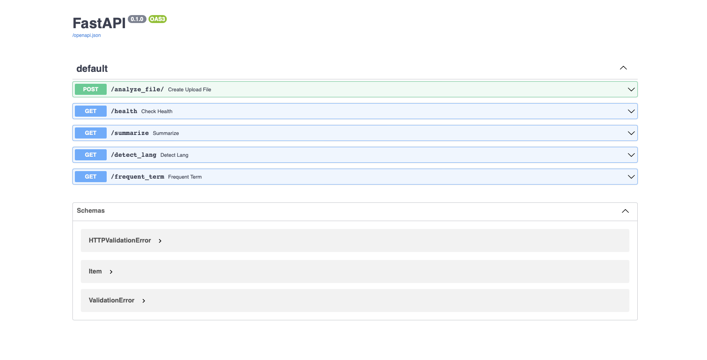

# nasa-spaceapp-inference

# Project Initialization

## Prerequisite
1. Git and Github
2. Python >= 3.7
3. Package Installer for Python (PIP)
## Setup

1. Clone the repository:
    ```bash
    git clone https://github.com/sahajrajmalla/nasa-spaceapp-inference.git
    ```

2. Open your terminal and apply these commands in Linux/ Mac.

    ```bash
    cd nasa-spaceapp-inference
    python3 -m venv venv
    source venv/bin/activate
    pip3 install -r requirements.txt
    uvicorn main:app --reload
    ```

3. Open your browser and enter http://localhost:8000/docs.

    


